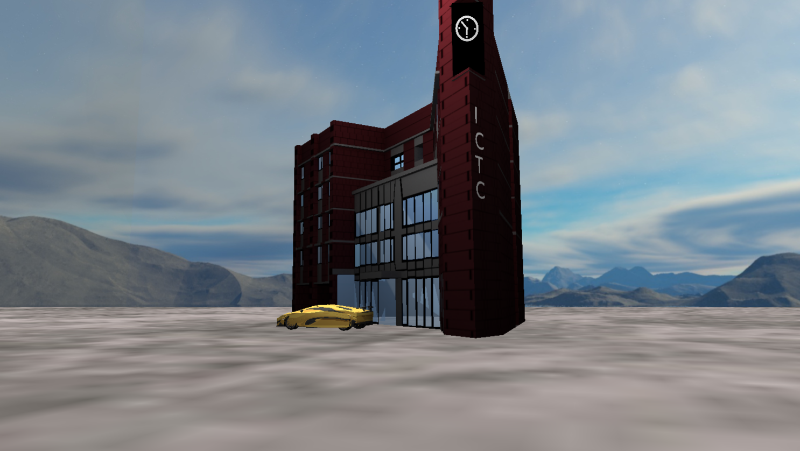

# ICTC Modeling using OpenGL

Academic project on Computer Graphics by @safalthapaliya, @samipism and @rabinadk1.
The screenshot of the project is shown below.



## Required packages

The project used `cmake` as the build system.
So, the users need to install `cmake` and `make` before following the instructions below.

## Building Instructions

The project should work on any OSes however, we have only tested it on Linux using GCC as the compiler.

From the base project directory, type in the following commands:

```sh
cmake -B build
pushd build && make -j$(nproc) && popd
build/ictc-modeling
```

`j$(nproc)` is the number of processors in the system.
So the above command makes the build in parallel using all the available processors.
If `j$(proc)` is not available, then use `j{num_cores}` or, even omit it completely instead.

The commands generate debug build by default. To generate to release build, type in the following commands:

### Release Build

From the base project directory, type in the following commands:

```sh
cmake -DCMAKE_BUILD_TYPE=Release -B build
pushd build && make -j$(nproc) && popd
build/ictc-modeling
```
